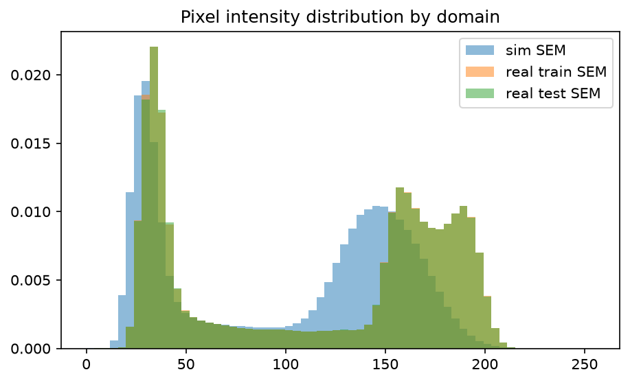
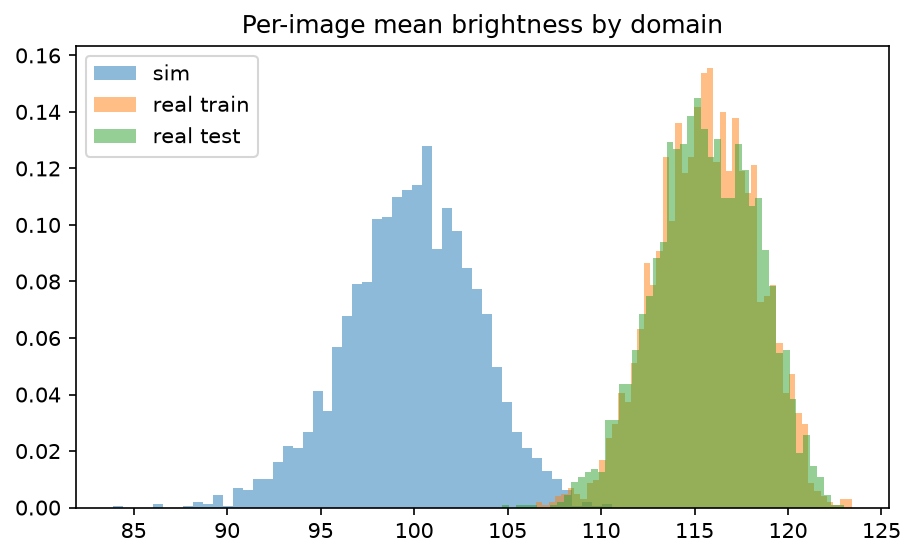
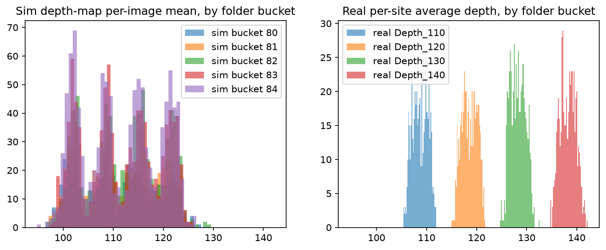
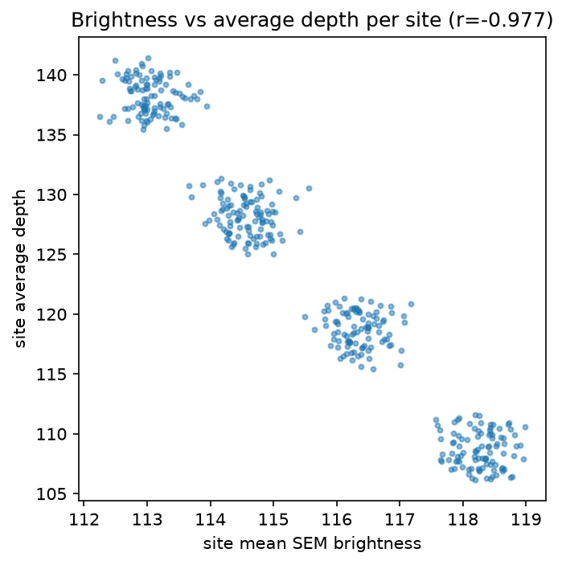
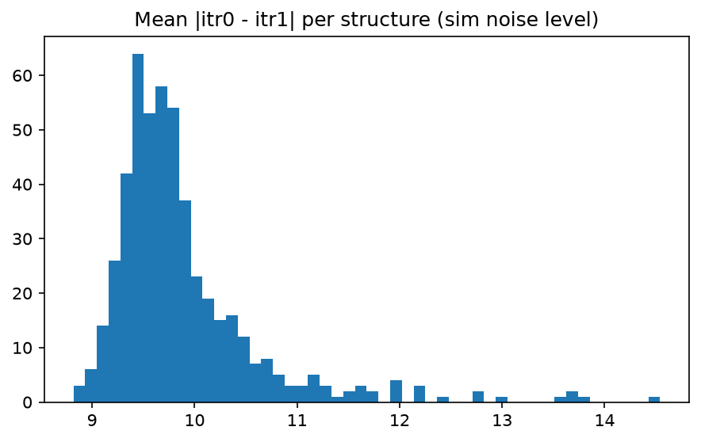
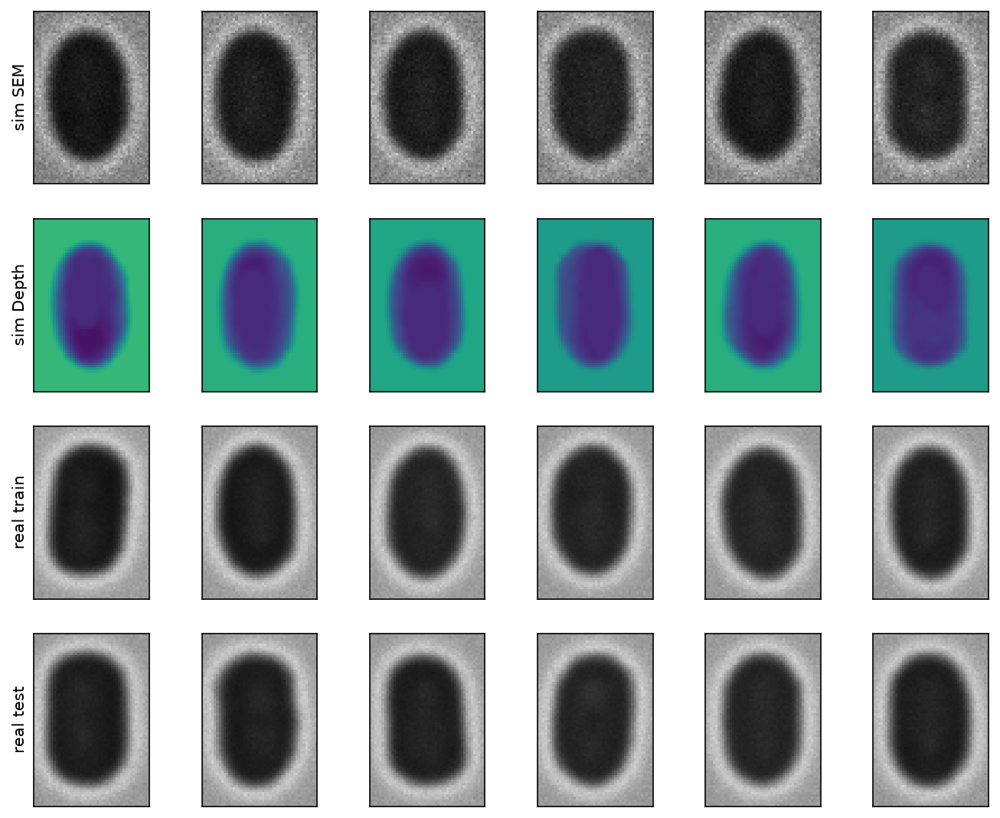

# EDA: 도메인 갭 정량화와 라벨 구조 분석

- 실행: `uv run python scripts/eda.py` (2026-08-24, 시드 고정 샘플링)
- 데이터 사실관계는 [docs/data-notes.md](../docs/data-notes.md) 참조

## 요약 (핵심 발견 5가지)

1. **외형 도메인 갭은 실재하지만 온건하다** — sim과 real의 픽셀 통계는 평균 99.9/115.6, 표준편차 57.8/65.8로 어긋나며, sim은 노이즈가 거칠고 real은 부드럽다. 입력 정렬(히스토그램 매칭·노이즈 모델링)이 유효할 것으로 보이는 규모.
2. **real train ↔ real test 분포는 사실상 동일하다** (115.6/65.8 vs 115.6/65.8) — 제출 없이 real train으로 계산하는 프록시 지표가 test 성능을 대변할 수 있다는 근거.
3. **밝기↔깊이 상관 r = −0.977** (site 단위, n=400) — "깊은 홀일수록 이차전자가 빠져나오기 어려워 어둡다"는 SEM 물리가 데이터에서 거의 결정론적으로 성립. 평균 깊이의 대부분은 밝기만으로 설명되며, 모델의 부가가치는 픽셀 수준 형상 복원에 있다.
4. **라벨 의미론이 두 도메인에서 다르다** — sim Depth map은 픽셀값이 "작을수록 깊음"(홀 내부가 저값), real `average_depth`는 "클수록 깊음"(Depth_140 폴더의 평균값 ≈ 138). 상관 부호(real: 밝기와 음의 상관 / sim 인코딩과는 방향 불일치)가 이를 증명. **둘을 잇는 아핀 변환은 미지수이며 Stage 2 약지도 설계의 핵심 과제.**
5. **라벨 시프트 존재** — sim depth map의 영상 평균은 폴더 버킷(80~84)과 무관하게 111±7.5에 몰려 있는 반면, real은 105~142(명목 110/120/130/140에 정합)로 4개 군집. 즉 **sim은 real 깊이 범위의 가운데만 커버**하고, real Depth_140급(≈138)은 sim 분포의 꼬리 밖이다. 지도학습만으로는 깊은 시편에서 계통적 과소 예측이 예상됨 → `average_depth` 약지도로 교정 필요.

## 그림별 소견

### 1. 도메인별 픽셀 강도 분포

sim은 저강도 쪽으로 치우치고(평균 99.9) 분포 형태도 다르다. real train과 test 곡선은 겹쳐 보일 정도로 일치 — 검증 전략(프록시)의 전제를 데이터가 지지한다.

### 2. 영상당 평균 밝기 분포

sim의 영상 평균 밝기는 88~108의 좁은 대역, real은 더 넓게 퍼져 있다. real의 퍼짐은 깊이 다양성(105~142)의 반영이다(그림 4 참조).

### 3. 라벨 분포: sim(버킷별 depth map 평균) vs real(버킷별 average_depth)

- sim: 버킷 80~84 모두 평균 ≈ 111.0~112.1 (±7.4~7.7) — **버킷 번호는 깊이가 아니다** (시뮬레이션 조건 또는 파티션으로 추정).
- real: 108.7 / 118.6 / 128.2 / 138.2 (±1.5) — 폴더 명목값과 정합, site 내 편차는 매우 작음.
- 두 축의 수치는 인코딩이 달라 직접 비교 불가(발견 4)지만, 분포의 "퍼짐" 차이는 그 자체로 라벨 시프트의 증거다.

### 4. site 평균 밝기 vs average_depth

r = −0.977. 밝기만으로 site 평균 깊이가 거의 선형 예측된다. 시사점 두 가지: ① 평균 수준(bias/scale)은 밝기 기반으로 캘리브레이션 가능한 저차원 문제, ② 리더보드 점수의 차별화는 평균이 아니라 **픽셀 수준 깊이 형상**의 정확도에서 나온다.

### 5. 동일 구조의 노이즈 실현 간 차이 (itr0 vs itr1)

평균 |itr0−itr1| = 9.89±0.74 (0–255 스케일). 같은 구조의 독립 노이즈 실현이 쌍으로 주어지므로, 노이즈 강건성(consistency) 학습과 "노이즈 수준의 하한" 추정에 활용 가능.

### 6. 예시 그리드

- 구조: 중앙의 타원형 홀. 내부는 어둡고(깊음) 테두리는 밝다(edge effect — 경사면에서 이차전자 방출 증가).
- sim은 입자성 노이즈가 강하고 경계가 날카로움; real은 부드럽고 블러가 큼 — 입력 정렬 기법이 좁혀야 할 갭의 시각적 실체.
- 구조가 상하/좌우 대칭에 가까워 **flip 증강은 안전**하다(계획의 가정 확인).

## Stage 2 설계에 주는 함의 (우선순위 근거)

| 순위 | 기법 | 근거 |
|---|---|---|
| 1 | `average_depth` 약지도 (스케일/바이어스 교정 포함) | 발견 4·5: 라벨 시프트가 가장 큰 계통 오차원(源)이고, 아핀 캘리브레이션이 필요 |
| 2 | 입력 정렬 (히스토그램 매칭 → 노이즈 모델링/FDA) | 발견 1: 외형 갭은 온건해서 가벼운 정렬로 효과 기대 |
| 3 | Self-training (pseudo-label) | 1·2로 갭을 좁힌 뒤 남는 잔차에 적용해야 안전 |
| - | itr consistency 정규화 | 발견 5(노이즈 수준): 보조 정규화로 검토 |

## 남은 질문 (Stage 2에서 실험으로 답할 것)

- sim depth 픽셀 인코딩 ↔ real average_depth 물리 스케일의 아핀 계수 — 첫 제출(리더보드 점수)과 real train 캘리브레이션 적합으로 추정
- Case_1~4의 의미(4개 촬영 조건 추정) — case별 밝기/노이즈 통계 분해
- 버킷 80~84의 의미 — depth와 무관함은 확인, 조건 변수인지 파티션인지는 미확인 (성능에는 비영향 추정)
